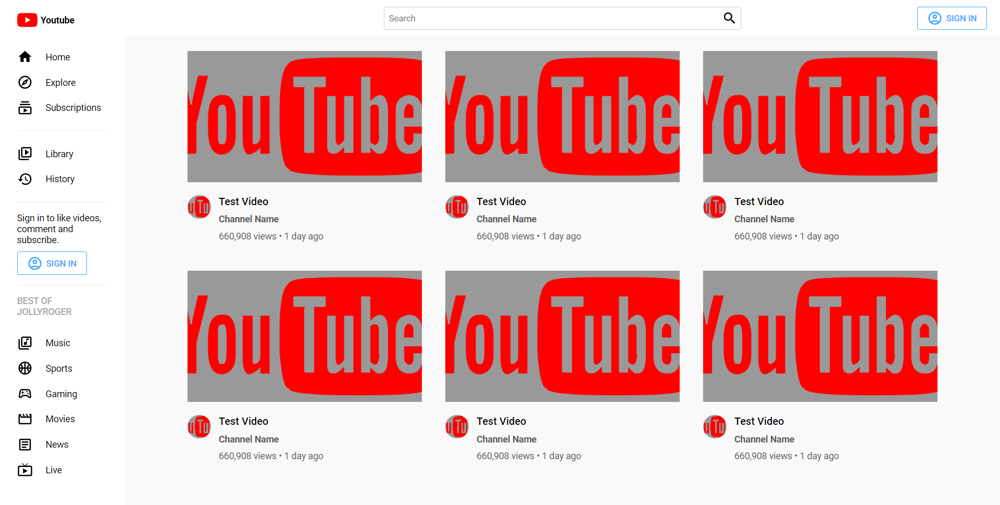
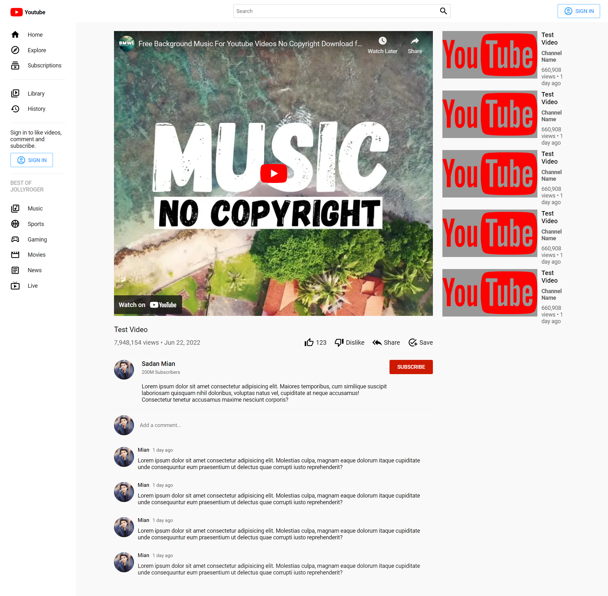
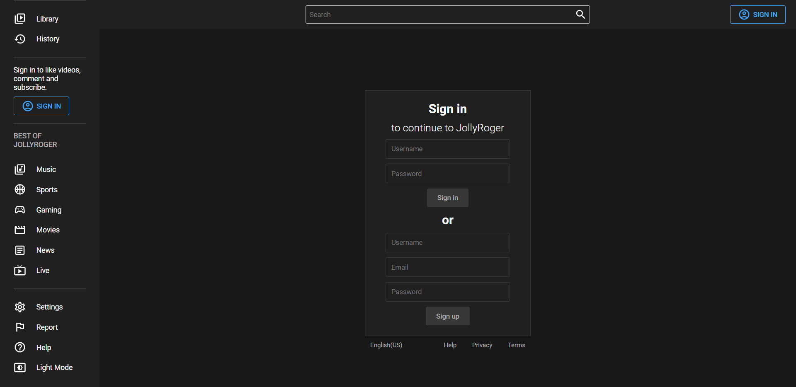

# Video Sharing App UI - React YouTube Clone



Welcome to the Video Sharing App UI project! This is a front-end user interface built using React.js that replicates the UI of YouTube. The clone includes a home page, a sign-in page, and a video page. In addition, the clone offers a dark mode functionality to enhance user experience.

## Table of Contents

- [Introduction](#video-sharing-app-ui---react-youtube-clone)
- [Features](#features)
- [Screenshots](#screenshots)
- [Installation](#installation)
- [Usage](#usage)
- [Contributing](#contributing)

## Features

- **Home Page:** Displays a list of videos and provides navigation to the video page.
- **Sign-In Page:** Allows users to log in to their accounts.
- **Video Page:** Provides detailed information about a selected video.
- **Dark Mode:** Offers a dark mode feature to customize the user interface.

## Screenshots


_Home Page_


_Sign-In Page_


_Video Page_


_Dark Mode_

## Installation

1. Clone the repository using the following command:

   ```bash
   git clone https://github.com/sadanmian/Video-Sharing-App.git
   ```

2. Navigate to the project directory:

   ```bash
   cd Video-Sharing-App
   ```

3. Install the required dependencies:

   ```bash
   npm install
   ```

## Usage

1. Start the development server:

   ```bash
   npm start
   ```

   This will launch the website in your default web browser. You can access it at `http://localhost:3000`.

2. Explore the home page to see a list of videos.

3. Click on a video to navigate to the video page.

4. Use the sign-in page to log in to your account.

5. Experience the dark mode functionality by toggling the dark mode switch.

## Contributing

Contributions are welcome! If you'd like to contribute to this project, please follow these steps:

1. Fork the repository.
2. Create a new branch for your feature or bug fix.
3. Make your changes and test them thoroughly.
4. Commit your changes with clear and concise commit messages.
5. Push your changes to your forked repository.
6. Create a pull request explaining your changes and their purpose.
